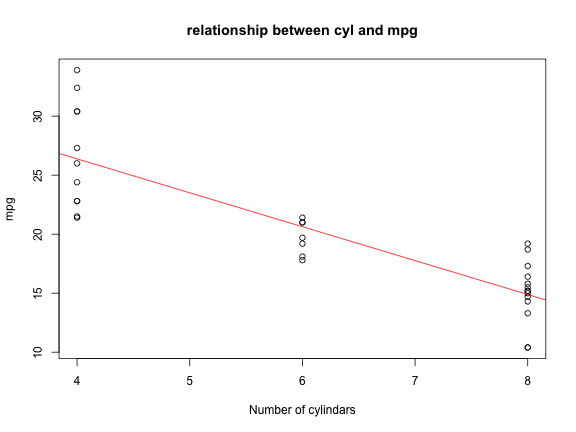

## mtcars dataset - Description

### Motor Trend Car Road Tests

> The data was extracted from the 1974 Motor Trend US magazine, and comprises fuel consumption and 10 aspects of automobile design and performance for 32 automobiles (1973–74 models).

### Source
> Henderson and Velleman (1981), Building multiple regression models interactively. Biometrics, 37, 391–411.


```r
library(datasets)
head(mtcars, 3)
```

```
##                mpg cyl disp  hp drat    wt  qsec vs am gear carb
## Mazda RX4     21.0   6  160 110 3.90 2.620 16.46  0  1    4    4
## Mazda RX4 Wag 21.0   6  160 110 3.90 2.875 17.02  0  1    4    4
## Datsun 710    22.8   4  108  93 3.85 2.320 18.61  1  1    4    1
```

---

## mtcars dataset - Format

**The data contains with 32 observations on 11 variables.**

| Index | Field | Detail |
------- | ----- | ------ |
| [, 1] | mpg | Miles/(US) gallon |
| [, 2]  | cyl | Number of cylinders |
| [, 3]    | disp | Displacement (cu.in.) |
| [, 4]    | hp | Gross horsepower |
| [, 5]    | drat | Rear axle ratio |
| [, 6]	| wt | Weight (lb/1000) |
| [, 7]	| qsec | 1/4 mile time |
| [, 8]	| vs | V/S |
| [, 9]	| am | Transmission (0 = automatic, 1 = manual) |
| [,10]	| gear | Number of forward gears |
| [,11]	| carb | Number of carburetors |

---

## Analysis - Fitting linear regression model
* The following example shows the relationship between cylindar and mpg
* Choose the variables by clicking on different variables' names on my [shinyApp]
(http://swhgoon.github.io/devdataprod-cp/part2_devdataprod-slidify)

 

---

## Analysis - Conducting Regression Analysis

* The t-test tests whether should we accept the regression coefficients
* The F-test tests whether should we accept the regression equation


```
## 
## Call:
## lm(formula = mpg ~ cyl, data = mtcars)
## 
## Residuals:
##    Min     1Q Median     3Q    Max 
## -4.981 -2.119  0.222  1.072  7.519 
## 
## Coefficients:
##             Estimate Std. Error t value Pr(>|t|)    
## (Intercept)   37.885      2.074   18.27  < 2e-16 ***
## cyl           -2.876      0.322   -8.92  6.1e-10 ***
## ---
## Signif. codes:  0 '***' 0.001 '**' 0.01 '*' 0.05 '.' 0.1 ' ' 1
## 
## Residual standard error: 3.21 on 30 degrees of freedom
## Multiple R-squared:  0.726,	Adjusted R-squared:  0.717 
## F-statistic: 79.6 on 1 and 30 DF,  p-value: 6.11e-10
```
